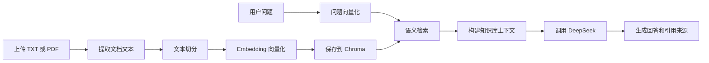

# WorkBuddy AI 学习助手

基于 FastAPI、DeepSeek、Sentence Transformers 和 Chroma 构建的本地知识库问答系统。

用户可以上传 TXT 或 PDF 文档，系统会自动完成文本提取、文档切分、向量化和语义检索，并结合检索结果生成带引用来源的回答。

## 界面预览

### 知识库问答


### 引用来源


## 核心功能

- 支持 TXT 和 PDF 文档上传
- 自动提取并切分文档内容
- 使用 `BAAI/bge-small-zh-v1.5` 生成中文文本向量
- 使用 Chroma 持久化保存向量知识库
- 根据语义相似度检索相关文档片段
- 调用 DeepSeek 生成基于知识库的回答
- 返回引用文件、片段编号和匹配分数
- 使用 SQLite 保存多轮聊天记录
- 使用 `session_id` 隔离不同会话
- 网页刷新后自动恢复聊天记录
- 提供知识库上传、问答和来源展示网页
- 提供 Swagger API 文档
- 使用 pytest 完成 API 自动化测试
- 支持 Docker Compose 一键部署
- 使用 Docker Volume 持久化数据

## 技术栈

| 分类 | 技术 |
| --- | --- |
| 开发语言 | Python 3.12 |
| Web 框架 | FastAPI |
| ASGI 服务器 | Uvicorn |
| 大模型 | DeepSeek |
| Embedding 模型 | BAAI/bge-small-zh-v1.5 |
| 向量数据库 | Chroma |
| 数据库 | SQLite |
| 文档解析 | PyPDF |
| 前端 | HTML、CSS、JavaScript |
| API 文档 | Swagger UI |
| 自动化测试 | pytest |
| 容器化部署 | Docker、Docker Compose |
| 版本管理 | Git、GitHub |

## 系统流程



## 项目结构

```text
02_fastapi_intro/
├── static/
│   ├── app.js
│   ├── index.html
│   └── style.css
├── sample_docs/
│   └── rag_intro.txt
├── tests/
│   └── test_api.py
├── docs/
│   └── images/
├── .dockerignore
├── .env
├── .gitignore
├── docker-compose.yml
├── Dockerfile
├── main.py
├── rag.py
├── README.md
├── requirements-prod.txt
└── requirements.txt
```

`.env`、SQLite 数据库、Chroma 数据和 Python 虚拟环境不会提交到 GitHub。

## 本地安装

推荐使用 Python 3.12。

### 1. 创建虚拟环境

```powershell
py -3.12 -m venv .venv
```

### 2. 激活虚拟环境

```powershell
Set-ExecutionPolicy -Scope Process -ExecutionPolicy Bypass
.\.venv\Scripts\Activate.ps1
```

### 3. 安装依赖

```powershell
python -m pip install -r requirements.txt
```

### 4. 配置环境变量

在项目根目录创建 `.env` 文件：

```env
DEEPSEEK_API_KEY=你的_DeepSeek_API_Key
```

请勿将真实 API Key 写入 README 或上传到 GitHub。

### 5. 启动项目

```powershell
python -m uvicorn main:app --reload
```

首次启动时需要加载 Embedding 模型，等待时间可能稍长。

## Docker 部署

安装 Docker Desktop，并确保 Docker Engine 正常运行。

### 1. 配置环境变量

在项目根目录创建 `.env` 文件：

```env
DEEPSEEK_API_KEY=你的_DeepSeek_API_Key
```

### 2. 构建并启动服务

```powershell
docker compose up -d --build
```

Docker 镜像使用 CPU 版 PyTorch，不需要安装 CUDA。

### 3. 查看容器状态

```powershell
docker compose ps
```

### 4. 查看运行日志

```powershell
docker compose logs -f --tail 100
```

按 `Ctrl+C` 可以退出日志查看，不会停止容器。

### 5. 停止容器

```powershell
docker compose down
```

该命令不会删除持久化数据。

### 6. 删除容器和持久化数据

```powershell
docker compose down -v
```

> 注意：该命令会永久删除 Docker 中的聊天记录、知识库和模型数据。

## 访问地址

服务启动后访问：

- 聊天网页：http://127.0.0.1:8000
- Swagger 文档：http://127.0.0.1:8000/docs
- 健康检查：http://127.0.0.1:8000/health

## 数据持久化

项目使用 Docker Volume 持久化保存：

- SQLite 聊天记录
- Chroma 向量知识库
- Hugging Face Embedding 模型

即使执行 `docker compose down` 并重新创建容器，聊天记录和知识库仍然存在。

## API 接口

| 请求方式 | 路径 | 功能 |
| --- | --- | --- |
| GET | `/health` | 查看服务状态 |
| POST | `/chat` | 普通 DeepSeek 多轮对话 |
| POST | `/reset` | 清空指定会话 |
| GET | `/history/{session_id}` | 查看聊天记录 |
| POST | `/documents/upload` | 上传知识库文档 |
| GET | `/documents` | 查看知识库状态 |
| POST | `/documents/search` | 语义检索文档 |
| POST | `/rag/chat` | 根据知识库回答问题 |

## RAG 问答示例

请求：

```json
{
  "session_id": "demo-user",
  "message": "怎样让人工智能参考自己的资料回答问题？",
  "top_k": 3
}
```

返回内容包括：

- 用户问题
- AI 助手回答
- 引用文件名
- 文档片段编号
- 语义匹配分数

## 自动化测试

安装测试依赖：

```powershell
python -m pip install pytest
```

运行测试：

```powershell
python -m pytest -v
```

当前测试覆盖：

- 健康检查
- 网页访问
- 知识库状态
- 会话清空
- 不支持的文件类型
- RAG 请求参数验证

## 项目亮点

- 实现从文档上传到回答生成的完整 RAG 数据链路
- 使用中文 Embedding 模型实现语义检索
- 使用 Chroma 持久化保存向量知识库
- 通过引用来源提高回答的可追溯性
- 使用 SQLite 实现多轮会话记忆
- 同时提供 REST API 和可视化聊天页面
- 使用 pytest 完成 API 自动化测试
- 使用 Docker Compose 实现一键部署
- 使用 Docker Volume 持久化聊天记录、向量数据和模型
- 使用健康检查监控容器运行状态
- 使用 Git 分支和 Pull Request 管理功能开发

## 后续计划

- 增加文档删除与知识库管理
- 增加流式回答
- 增加用户登录和会话管理
- 增加 Agent 工具调用能力
- 部署到云服务器并提供在线演示